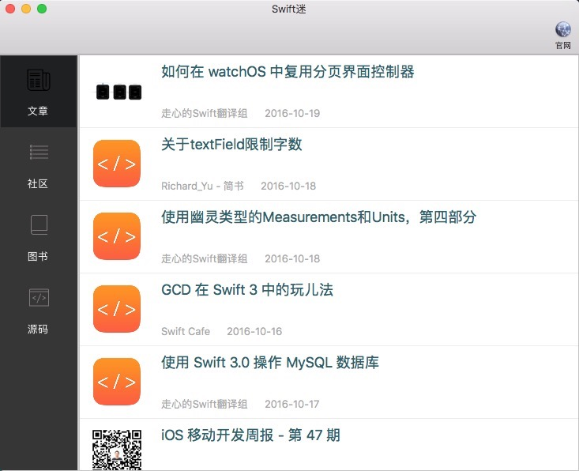
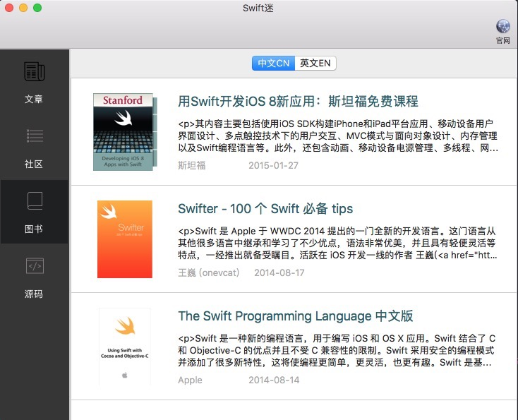
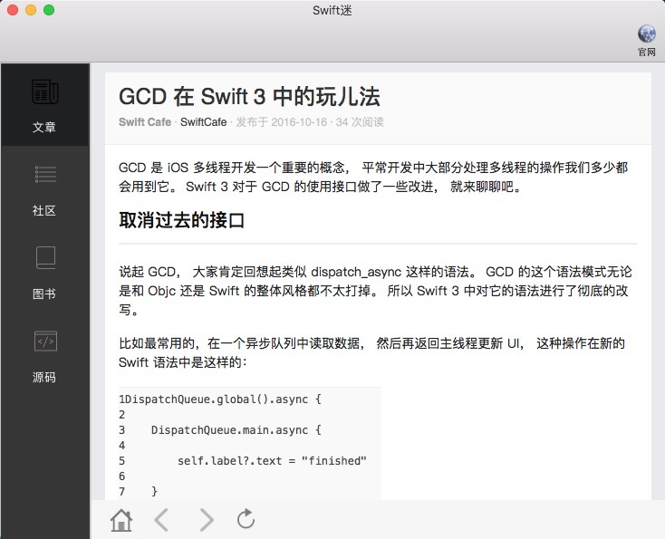

# swiftmi-mac

#### swiftmi.com Mac版本

感谢`swift迷`社区开源，才有了这个项目

刚开始学习mac应用开发，个人能力有限，难免会有很多Bug，欢迎大家提`Issues`

## 预览

## 环境

- macOS 10.11+
- Swift3.0+
- Xcode8.0+

## swift迷社区 
- 官网 http://www.swiftmi.com
- iOS版源码 https://github.com/swiftmi/swiftmi-app
- mac端StatusBar插件 https://github.com/swiftmi/swiftmi-osx
- API参考 https://github.com/swiftmi/swiftmi-app/blob/master/server-api.md
